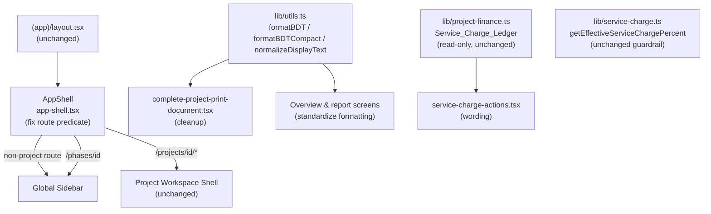

# Design Document

## Overview

This is a tightly scoped production-readiness/polish pass for the existing Sharebuild ERP (Next.js 14 App Router + RSC, Prisma 5). It fixes five concrete issues without redesigning anything. The currently implemented code is the source of truth, and the changes below are deliberately minimal and local.

The five areas map 1:1 to five implementation tasks:

1. Sidebar/layout consistency — a single regex fix in `AppShell`.
2. Service charge wording — copy/presentation change in one orphaned component.
3. Financial labels & currency formatting consistency — standardize on `formatBDT`/`formatBDTCompact`.
4. Complete Project Report cleanup — text normalization, no raw IDs, print readability.
5. Final verification — build, seed, totals checks.

Key facts confirmed against the code during design:

- `(app)/layout.tsx` wraps every `(app)` route in `AppShell`, so `AppShell` is the single control point for which sidebar renders. No other layout file needs to change.
- `AppShell` (`src/components/layout/app-shell.tsx`) currently treats both `/projects/[id]/*` **and** `/phases/[id]/*` as "project workspace" routes and hides the global sidebar. But `src/app/(app)/phases/[id]/page.tsx` has **no** project layout, so that route renders with **no sidebar at all**. This is the root cause.
- `ServiceChargeActions` (`src/components/projects/service-charge-actions.tsx`) is currently **not imported or rendered anywhere** (confirmed by repository search). The actual service-charge summary screen is `src/app/(app)/projects/[id]/finance/service-charge/page.tsx`, which already reads `getProjectServiceChargeLedger`. This makes the wording change very low risk.
- `getProjectServiceChargeLedger` in `src/lib/project-finance.ts` already exposes per-phase `billedAmount`, `collectedAmount`, `uncollectedAmount` and ledger totals `billedTotal`, `collectedTotal`, `uncollectedTotal`. No new computation is required.
- `getEffectiveServiceChargePercent` in `src/lib/service-charge.ts` implements the precedence phase override → project default → company default → 0. It must remain untouched.
- `formatBDT` / `formatBDTCompact` already exist in `src/lib/utils.ts`. `formatBDT` uses `Tk ` prefix + `en-IN` grouping + 0–2 fraction digits.
- `normalizeDisplayText` in `src/lib/utils.ts` is a fragile heuristic: it only acts when `/[àâðÂ]/` matches and uses `decodeURIComponent(escape(value))`, returning the original on any `U+FFFD` in the decoded result.

## Architecture

No architectural change. All edits are confined to a small set of existing files:



The accounting/aggregation layer (`project-finance.ts`, `project-cost-report.ts`, `lib/accounting`), the Prisma schema, and `prisma/seed.ts` are **out of scope for behavioral change**.

## Components and Interfaces

### Task 1 — Sidebar/layout consistency

**File:** `src/components/layout/app-shell.tsx` (only file changed).

The current predicate over-matches:

```ts
const isProjectWorkspace =
  /^\/projects\/[^/]+(\/|$)/.test(pathname) || /^\/phases\/[^/]+(\/|$)/.test(pathname);
```

The `/phases/[id]` branch is wrong: that global route has no project layout, so hiding the global sidebar leaves it with none. The corrected condition matches **only genuine project workspace routes**:

```ts
// Only project workspace routes (/projects/[id] and nested) own a sidebar
// via the project layout. Everything else — including the global
// /phases/[id] route — must keep the global sidebar.
const isProjectWorkspace = /^\/projects\/[^/]+(\/|$)/.test(pathname);
```

Extract this into a small pure helper so it is unit-testable and self-documenting:

```ts
export function isProjectWorkspaceRoute(pathname: string): boolean {
  return /^\/projects\/[^/]+(\/|$)/.test(pathname);
}
```

Behavior after the fix:
- `/projects/{id}` and `/projects/{id}/...` → project workspace shell only (no global sidebar). (Req 1.3)
- `/phases/{id}` → global sidebar (no longer suppressed). (Req 1.2)
- `/dashboard`, `/projects`, `/company/...`, and anything else → global sidebar. (Req 1.4, 1.5)

No navigation links or route targets change. (Req 1.6)

### Task 2 — Service charge wording

**File:** `src/components/projects/service-charge-actions.tsx`.

Recommended least-risky approach:

- **Backend untouched.** Leave the `/api/projects/[id]/service-charge` calculate/approve/reverse actions in place. They are still valid internal operations; this pass only changes how service charge is *presented*, satisfying the guardrail of preserving working routes/UI (Req 1.6 / Constraint 9) and "no new settlement workflow" (Req 2.7).
- **Replace the "Service Charge Ledger" calculate/approve framing and the "separate settlement"/"operational settlement" copy** with a read-only presentation of **billed / collected / uncollected**, plus a one-line note that service charge is included in buyer demand and collected through normal buyer collection. (Req 2.1, 2.2, 2.3, 2.4)
- **Source values from the existing ledger.** The presentation reads `billedAmount`, `collectedAmount`, `uncollectedAmount` (per phase) and/or `billedTotal`, `collectedTotal`, `uncollectedTotal` (totals) from `getProjectServiceChargeLedger`. The component does not recompute anything. (Req 2.5)
- **No change to `getEffectiveServiceChargePercent`.** (Req 2.6, Constraint 3)

Proposed prop shape (presentation-only):

```ts
type ServiceChargeSummaryRow = {
  phaseName: string;
  billedAmount: number;
  collectedAmount: number;
  uncollectedAmount: number;
};

// Component renders billed / collected / uncollected columns + a billing-flow note.
// All values formatted via formatBDT.
```

Note: because `ServiceChargeActions` is currently not rendered anywhere, the visible improvement should land on the actual screen `src/app/(app)/projects/[id]/finance/service-charge/page.tsx`. The implementation task will either (a) update that page's copy/presentation directly, or (b) wire the cleaned-up component into it. Either way the deprecated calculate/approve-ledger and separate-settlement wording is removed from what the user sees. The `service-charge/page.tsx` "Separate manual settlement…" and "Legacy separate service-charge settlement" copy is part of this cleanup.

### Task 3 — Financial labels & currency formatting consistency

**Files:** overview and report screens that currently format money inline; centralize on `src/lib/utils.ts` helpers (no signature change).

Approach:
- Audit overview and report views for ad-hoc inline currency formatting (literal `Tk `, `৳`, `toLocaleString`, manual `BDT` strings) and replace with `formatBDT` (full precision) or `formatBDTCompact` (KPI tiles). (Req 3.1)
- Keep one currency prefix (`Tk `) and one grouping/decimal style (`en-IN`, 0–2 fraction digits) — already the behavior of `formatBDT`; the work is making call sites consistent. (Req 3.2)
- Use consistent wording for the same concept across overview and reports (e.g. one term for collected income, one for project balance). (Req 3.3)
- **Numeric aggregation results must not change** — this is labels/formatting only. (Req 3.5, Constraint 8)

`formatBDT`/`formatBDTCompact` are already deterministic pure functions; no change to their logic is expected. If any locale ambiguity is found, pin the format explicitly, but do not alter rounding.

### Task 4 — Complete Project Report cleanup

**Files:** `src/lib/complete-project-report.ts`, `src/components/reports/complete-project-print-document.tsx`.

(a) **Mojibake / Bangla** — centralize and consistently apply `normalizeDisplayText` so every user-facing text cell (project, buyer, supplier, subcontractor, phase, party, description, cheque party) is normalized, and the normalizer never surfaces replacement characters. The current normalizer already falls back to the original string when the decode produces `U+FFFD`; the cleanup ensures it is applied uniformly (some cells already call it; audit for any that don't) and that the helper's "clean text in → identical text out" guarantee holds. (Req 4.1, 4.3)

(b) **No raw internal IDs** — audit the print document for any cuid leakage in *visible* cells. React `key={row.id}` props are not user-visible and are fine. Visible identifiers must be human-meaningful: bill no / voucher no (`sourceNo`, `billNo`, `chequeNo`), unit no (`unitNo`), and party/buyer/phase names — all of which already exist in the data. Replace any visible id with these. (Req 4.2)

(c) **Print/PDF readability** — the print primitives in `print-document.tsx` already provide `avoid-break` (on `PrintTable`, `PrintNoteBox`, empty states) and `page-break-before` (on `PrintPage`/`PrintSection`). Cleanup focuses on: sensible column widths for dense tables, right-aligned monetary columns rendered via `PrintAmount` (already `tabular-nums`), and keeping rows from splitting across pages where feasible (lean on `avoid-break`; add per-row break-avoidance only where a row currently splits). (Req 4.4)

(d) **Service charge description** — keep the existing "billed through buyer demand and collected through normal buyer collection" note. (Req 4.6)

All report monetary totals remain numerically unchanged. (Req 4.5, Constraint 8)

### Task 5 — Final verification

No production code; this is a verification task. Steps:
1. `next build` → zero TypeScript errors. (Req 5.1)
2. Run the seed → Relax Tower Top Sheet totals within ±1.00: Income 100,143,800; Expense 104,659,890.40; Balance −4,516,090.40. (Req 5.2)
3. Compare Complete Project Report totals before/after → unchanged within ±1.00. (Req 5.3)
4. If any step fails, report the failing step and the observed value. (Req 5.4)

## Data Models

No data model or Prisma schema changes. Existing read-only shapes are reused:

- `Service_Charge_Ledger` row (from `getProjectServiceChargeLedger`): includes `phaseName`, `serviceChargeAmount`, `billedAmount`, `collectedAmount`, `uncollectedAmount`, `percentage`, `basisAmount`, `includedInDemand`, `settlementStatus`. Ledger `totals` include `billedTotal`, `collectedTotal`, `uncollectedTotal`.
- `getEffectiveServiceChargePercent({ companyDefaultPct, projectDefaultPct, phaseOverridePct })` → number, with precedence phase → project → company → 0 (unchanged).
- Currency helpers: `formatBDT(amount) → "Tk <grouped>"`, `formatBDTCompact(amount) → "Tk <n> Cr|L|K"`.

## Correctness Properties

*A property is a characteristic or behavior that should hold true across all valid executions of a system — essentially, a formal statement about what the system should do. Properties serve as the bridge between human-readable specifications and machine-verifiable correctness guarantees.*

This pass is mostly cosmetic (layout, copy, print presentation), so correctness properties are intentionally minimal and focused on the **guardrails** (resolver precedence, deterministic formatting, safe text normalization). Most acceptance criteria are validated by manual/visual print checks, code review, and the build + seed-totals verification gates rather than by properties (see Testing Strategy).

### Property 1: Effective service-charge percent precedence is preserved

*For any* combination of present-or-absent `companyDefaultPct`, `projectDefaultPct`, and `phaseOverridePct` values, `getEffectiveServiceChargePercent` SHALL return the highest-priority **present** value in the order phase override → project default → company default, and `0` when all are absent.

**Validates: Requirements 2.6**

### Property 2: Currency formatting is deterministic and consistently shaped

*For any* finite numeric input, `formatBDT` SHALL produce the same output string on repeated calls (determinism), and that string SHALL begin with the single agreed `Tk ` prefix and use the agreed `en-IN` grouping/decimal style (0–2 fraction digits).

**Validates: Requirements 3.2, 3.4**

### Property 3: Display-text normalization is safe and lossless on valid text

*For any* already-clean string (including valid Bangla and arbitrary Unicode that contains no mojibake markers), `normalizeDisplayText` SHALL return the input unchanged, and for all inputs its output SHALL never contain the Unicode replacement character `U+FFFD`.

**Validates: Requirements 4.1, 4.3**

## Error Handling

- **Route predicate:** `isProjectWorkspaceRoute` is total over any string; non-matching paths fall back to the global sidebar, guaranteeing no route is left sidebar-less (Req 1.5).
- **Service charge presentation:** values are read defensively (`?? 0`) from the ledger; a missing/null ledger renders an empty/zero state without throwing. No write actions are added.
- **Currency formatting:** `formatBDT`/`formatBDTCompact` already coerce null/undefined/non-finite input to `0` via `coerceNumber`; this behavior is preserved.
- **Text normalization:** `normalizeDisplayText` returns the original string on any decode failure or replacement-character result, never surfacing broken glyphs.
- **Verification:** if build, seed, or totals checks fail, the verification task reports the failing step and observed value rather than silently passing (Req 5.4).

## Testing Strategy

This is predominantly UI/text/report polish, so verification leans on manual/visual checks and a small set of targeted automated tests. We deliberately do **not** over-apply property-based testing.

### Primary correctness gates (most important)
- **Build:** `next build` completes with zero TypeScript errors (Req 5.1).
- **Seed + Top Sheet totals:** run the seed and confirm Relax Tower totals within ±1.00 — Income 100,143,800; Expense 104,659,890.40; Balance −4,516,090.40 (Req 5.2, Constraint 1).
- **Report totals unchanged:** capture Complete Project Report monetary totals before the pass and confirm they are unchanged within ±1.00 after (Req 5.3, 5.5/4.5).

### Manual / visual checks
- Navigate `/dashboard`, `/projects`, `/projects/{id}`, `/projects/{id}/finance`, `/phases/{id}`, `/company/...` and confirm exactly one correct sidebar on each (Req 1.1–1.5).
- Visually review the service charge screen: billed/collected/uncollected present; no calculate/approve-ledger or separate/operational-settlement wording (Req 2.1–2.4).
- Print/PDF the Complete Project Report: clean text (no mojibake), no raw cuids in visible cells, legible columns, aligned monetary values, no avoidable row splits (Req 4.1–4.4).

### Targeted unit tests (pure functions)
Use the project's existing test runner. Keep these few and focused:
- `isProjectWorkspaceRoute` over representative paths (`/projects/x`, `/projects/x/finance` → true; `/phases/x`, `/dashboard`, `/projects`, `/company/settings` → false) (Req 1.2–1.5).
- Optional render assertion that the service charge presentation contains no "separate settlement"/"operational settlement" text (Req 2.4).

### Property-based tests (minimal — pure helpers only)
PBT applies only to the three pure-function guardrail properties above. Use a property-based testing library for the target language (e.g. fast-check for TypeScript) — do not hand-roll. Each property test:
- Runs a **minimum of 100 iterations**.
- Implements exactly **one** design property.
- Is tagged with a comment in the format **`Feature: production-readiness-pass, Property {number}: {property_text}`**.

Mapping:
- Property 1 → precedence regression guard for `getEffectiveServiceChargePercent`.
- Property 2 → `formatBDT` determinism + consistent prefix/grouping shape.
- Property 3 → `normalizeDisplayText` no-op/safety on clean text (never emits `U+FFFD`).

### Out of scope for automated testing
Aggregation logic, Prisma schema, and seed totals are guardrails verified by the seed/report gates above, not by new unit/property tests. No accounting-aggregation or schema change is made in this pass.

## Constraints (Hard Guardrails — restated)

These apply to every task and override any tempting refactor:

1. Preserve Relax Tower Top Sheet totals: Income 100,143,800; Expense 104,659,890.40; Balance −4,516,090.40 (±1.00 each).
2. Do not change `prisma/seed.ts` seed totals.
3. No Prisma schema change — **stop and ask first** if any change appears to require one.
4. No accounting-aggregation change — **stop and ask first** if any change appears to require one.
5. Preserve the `getEffectiveServiceChargePercent` precedence (phase → project → company → 0) unchanged.
6. Supplier bill items remain project cost rows.
7. Supplier payments are **not** project cost rows.
8. Subcontractor payments are **not** project cost rows.
9. Preserve existing working routes and UI behavior (backward compatibility).
10. Currency formatting is deterministic.
11. `next build` completes with zero TypeScript errors.
