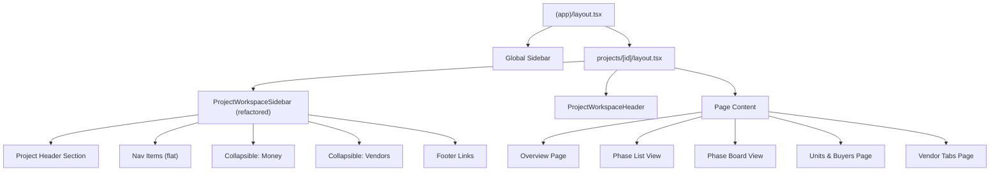
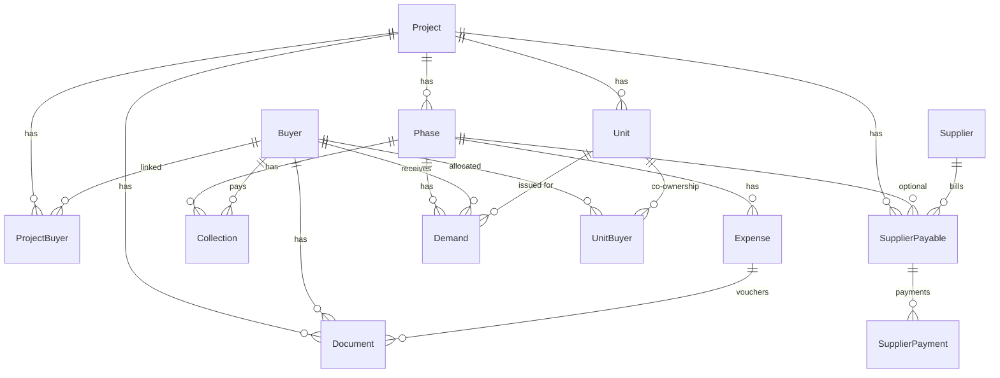

# Design Document: Project Workspace Refactor

## Overview

This design restructures the Sharebuild ERP project workspace (`/projects/[id]/*`) from a partially-complete kanban-first layout into a fully self-contained, project-first working environment. The refactor introduces:

1. A **collapsible Project Sidebar** with grouped Money/Vendors sections replacing the flat nav list
2. A **table-first Phase List View** as the default at `/projects/[id]/phases` with the kanban board moved to `/projects/[id]/phases/board`
3. An enhanced **Command Center overview** with full KPI metrics and quick-action buttons
4. A new **Units & Buyers page** combining unit allocation, ownership shares, and financial status
5. **Buyer Document Management** scoped to project + buyer
6. A **Vendor area** with explicit Supplier/Subcontractor separation
7. **Project-scoped Money routes** with pre-populated forms

The refactor does NOT modify the Prisma schema, does NOT create new migrations, and preserves all global/legacy routes.

### Design Rationale

The current workspace sidebar is a flat list of 10 items. Requirements call for 8 top-level items with 2 collapsible groups (Money with 4 sub-items, Vendors with 5 sub-items). This reduces cognitive load while keeping all routes accessible within one click. The phase default view switches from kanban (which requires horizontal scrolling and doesn't show financial columns) to a table that surfaces the data site engineers need daily.

## Architecture

### Routing Structure

```
src/app/(app)/projects/[id]/
├── layout.tsx                    # Project workspace shell (sidebar + header)
├── page.tsx                      # Overview command center (Req 4)
├── phases/
│   ├── page.tsx                  # Phase List View - table (Req 2)
│   └── board/
│       └── page.tsx              # Phase Board View - kanban (Req 3)
├── units-buyers/
│   └── page.tsx                  # Units & Buyers combined page (Req 5)
├── buyers/
│   ├── page.tsx                  # (existing, kept for backward compat)
│   └── [buyerId]/
│       └── documents/
│           └── page.tsx          # Buyer document management (Req 6)
├── vendors/
│   └── page.tsx                  # Vendors area with tabs (Req 7)
├── subcontractors/
│   └── page.tsx                  # Dedicated subcontractor listing (Req 7.5)
├── collections/
│   ├── page.tsx                  # Project-scoped collections list (Req 8)
│   └── new/
│       └── page.tsx              # New collection form (pre-populated)
├── expenses/
│   ├── page.tsx                  # Project-scoped expenses list (Req 8)
│   └── new/
│       └── page.tsx              # New expense form (pre-populated)
├── demands/
│   └── page.tsx                  # Project-scoped demands list (Req 8)
├── due-followup/
│   └── page.tsx                  # Due follow-up (Req 8)
├── payables/
│   ├── page.tsx                  # Supplier payables list
│   └── new/
│       └── page.tsx              # New payable form
├── documents/
│   └── page.tsx                  # Project documents
└── reports/
    └── top-sheet/
        └── page.tsx              # Project top sheet (Req 8.3)
```

### Component Architecture



### Key Design Decisions

| Decision | Choice | Rationale |
|----------|--------|-----------|
| Sidebar collapse mechanism | Client-side state with `useState` | Matches existing sidebar pattern; no server round-trip needed |
| Phase List financial aggregates | Server-side Prisma queries in RSC | Consistent with existing overview page pattern; avoids client-side data fetching |
| Board view column assignment | Computed from data (demands, expenses, docs) | Requirements define columns by business rules, not by PhaseStatus enum directly |
| Units & Buyers as new route | `/units-buyers` (not replacing `/buyers`) | Preserves backward compatibility per Req 9 |
| Vendor tabs | Single page with Radix Tabs | Reuses existing `@radix-ui/react-tabs` dependency |
| Document upload | Server action with file validation | Next.js 14 server actions pattern; validates size/type server-side |
| Currency formatting | Existing `formatBDT` utility | Already handles BDT with 2 decimal places |

## Components and Interfaces

### ProjectWorkspaceSidebar (Refactored)

```typescript
// src/components/layout/project-workspace-sidebar.tsx

interface ProjectMeta {
  id: string;
  name: string;
  nameBn: string | null;
  status: string;
  code: string | null;
}

interface NavItem {
  label: string;
  href: string;
  icon: React.ElementType;
  end?: boolean;
}

interface CollapsibleNavGroup {
  label: string;
  icon: React.ElementType;
  children: NavItem[];
}

type SidebarEntry = NavItem | CollapsibleNavGroup;

// Navigation structure per Req 1.3-1.5
function workspaceNav(projectId: string): SidebarEntry[] {
  const base = `/projects/${projectId}`;
  return [
    { label: 'Overview', href: base, icon: LayoutDashboard, end: true },
    { label: 'Units & Buyers', href: `${base}/units-buyers`, icon: Users },
    { label: 'Phases', href: `${base}/phases`, icon: Layers },
    {
      label: 'Money',
      icon: Receipt,
      children: [
        { label: 'Collections', href: `${base}/collections`, icon: Receipt },
        { label: 'Expenses', href: `${base}/expenses`, icon: ShoppingCart },
        { label: 'Demands', href: `${base}/demands`, icon: FileText },
        { label: 'Due Follow-up', href: `${base}/due-followup`, icon: AlertCircle },
      ],
    },
    {
      label: 'Vendors',
      icon: Truck,
      children: [
        { label: 'Suppliers', href: `${base}/vendors`, icon: Truck },
        { label: 'Supplier Bills', href: `${base}/payables`, icon: Receipt },
        { label: 'Supplier Payments', href: `${base}/payables?tab=payments`, icon: Receipt },
        { label: 'Subcontractors', href: `${base}/subcontractors`, icon: Truck },
        { label: 'Subcontractor Bills', href: `${base}/payables?type=subcontractor`, icon: FileText },
      ],
    },
    { label: 'Documents', href: `${base}/documents`, icon: FileText },
    { label: 'Reports', href: `${base}/reports/top-sheet`, icon: BarChart3 },
    { label: 'Audit', href: `${base}/audit`, icon: Shield },
  ];
}
```

### Phase List View Component

```typescript
// src/app/(app)/projects/[id]/phases/page.tsx

interface PhaseRow {
  id: string;
  name: string;
  status: PhaseStatus;
  sequence: number;
  progress: number;           // 0-100 integer
  collectionTotal: number;    // sum of Collection.amount
  expenseTotal: number;       // sum of Expense.amount
  balance: number;            // collectionTotal - expenseTotal
  buyerDue: number;           // sum of non-paid/cancelled Demand.amount
  payable: number;            // sum of SupplierPayable.dueAmount
}

// Columns: Phase Name | Status | Progress | Collection Total | Expense Total | Balance | Buyer Due | Payable | Actions
// Actions: View, Add Expense, Record Collection, Issue Demand, Edit, Report
```

### Phase Board View Component

```typescript
// src/app/(app)/projects/[id]/phases/board/page.tsx

// Board columns are computed from business rules, NOT from PhaseStatus:
type BoardColumn = 'Planned' | 'Demand Issued' | 'Running' | 'Final Bill Pending' | 'Ready for Audit';

interface BoardColumnDef {
  title: BoardColumn;
  filter: (phase: PhaseWithAggregates) => boolean;
}

const BOARD_COLUMNS: BoardColumnDef[] = [
  { title: 'Planned', filter: (p) => p.demandCount === 0 && p.expenseCount === 0 },
  { title: 'Demand Issued', filter: (p) => p.demandCount > 0 && p.approvedExpenseCount === 0 },
  { title: 'Running', filter: (p) => p.approvedExpenseCount > 0 },
  { title: 'Final Bill Pending', filter: (p) => p.expenseCount > 0 && p.pendingExpenseCount > 0 && p.approvedExpenseCount > 0 },
  { title: 'Ready for Audit', filter: (p) => p.allExpensesApproved && p.allApprovedExpensesHaveDocs },
];

// Only shows phases with status DRAFT or ACTIVE (Req 3.3)
```

### Overview Command Center

```typescript
// src/app/(app)/projects/[id]/page.tsx (enhanced)

interface ProjectKPIs {
  totalCollection: number;
  totalExpense: number;
  netBalance: number;
  buyerDue: number;
  supplierPayable: number;      // MATERIAL_SUPPLIER, EQUIPMENT_SUPPLIER, SERVICE_PROVIDER, CONSULTANT
  subcontractorPayable: number; // LABOUR_CONTRACTOR only
  activePhaseCount: number;
  missingVoucherCount: number;
  pendingApprovalCount: number;
}

interface QuickAction {
  label: string;
  href: string;
  icon: React.ElementType;
  color: string;
}
```

### Units & Buyers Page

```typescript
// src/app/(app)/projects/[id]/units-buyers/page.tsx

interface UnitsBuyersSummary {
  totalUnits: number;
  soldBookedUnits: number;      // SOLD | BOOKED | REGISTERED
  availableUnits: number;       // AVAILABLE
  buyerCount: number;           // distinct buyers via ProjectBuyer
  coOwnedUnitCount: number;     // units with >1 UnitBuyer
  totalBuyerDue: number;        // sum of Due/Advance across all buyers
}

interface BuyerRow {
  buyerId: string;
  buyerName: string;
  units: string[];              // unit numbers
  sharePercent: number;         // from UnitBuyer
  totalDemand: number;          // sum Demand.amount (excl CANCELLED)
  totalPaid: number;            // sum Collection (COLLECTION) - sum Collection (REFUND)
  dueAdvance: number;           // totalDemand - totalPaid
  documentCount: number;        // Document where projectId AND buyerId match
}
```

### Buyer Document Upload

```typescript
// Server action for document upload

interface DocumentUploadInput {
  projectId: string;
  buyerId: string;
  documentType: 'NID_FRONT' | 'NID_BACK' | 'AGREEMENT' | 'PAYMENT_PROOF' | 'REGISTRATION_PAPER' | 'MUTATION_PAPER' | 'OTHER';
  file: File;  // max 5MB, PDF/JPG/JPEG/PNG
}

// Validation rules:
// - file.size <= 5 * 1024 * 1024 (5MB)
// - file.type in ['application/pdf', 'image/jpeg', 'image/jpg', 'image/png']
// - projectId must exist and belong to user's company
// - buyerId must be linked to project via ProjectBuyer
```

### Vendor Area

```typescript
// src/app/(app)/projects/[id]/vendors/page.tsx

// Suppliers tab: supplierType in [MATERIAL_SUPPLIER, EQUIPMENT_SUPPLIER]
// Subcontractors tab: supplierType in [LABOUR_CONTRACTOR, SERVICE_PROVIDER]
// Excluded: CONSULTANT (Req 7.7)

interface VendorRow {
  supplierId: string;
  supplierName: string;
  supplierType: SupplierType;
  totalBilled: number;          // sum SupplierPayable.totalAmount
  paidAmount: number;           // sum SupplierPayable.paidAmount
  outstandingDue: number;       // sum SupplierPayable.dueAmount
}
```

## Data Models

No schema changes are required. The refactor operates entirely on the existing Prisma models. Key query patterns:

### Financial Aggregation Queries

```typescript
// Phase List View - per-phase aggregates
// Uses: Collection (via phaseId), Expense (via phaseId), Demand (via phaseId), SupplierPayable (via phaseId)

// Progress calculation:
// progress = (approvedExpenseCount / totalExpenseCount) * 100
// Where approvedExpenseCount = count(Expense where status = 'APPROVED' AND phaseId = phase.id)

// Board View column assignment:
// Planned: no demands AND no expenses for the phase
// Demand Issued: has demands BUT no approved expenses
// Running: has at least one approved expense
// Final Bill Pending: has expenses but at least one is PENDING_APPROVAL
// Ready for Audit: all expenses APPROVED AND all approved expenses have ≥1 Document

// Overview KPIs:
// buyerDue = per buyer: max(0, sum(Demand.amount where status NOT IN [FULLY_PAID, CANCELLED]) - sum(Collection.amount))
// supplierPayable = sum(SupplierPayable.dueAmount) WHERE supplier.supplierType IN [MATERIAL_SUPPLIER, EQUIPMENT_SUPPLIER, SERVICE_PROVIDER, CONSULTANT]
// subcontractorPayable = sum(SupplierPayable.dueAmount) WHERE supplier.supplierType = LABOUR_CONTRACTOR
```

### Scoping Pattern

All project workspace queries follow this pattern:

```typescript
// Direct project scope (SupplierPayable, Document, Unit, ProjectBuyer):
where: { projectId: params.id }

// Indirect project scope via phase (Collection, Expense, Demand):
where: { phase: { projectId: params.id } }

// Company-level access check (in layout):
where: { id: params.id, companyId: session.user.companyId }
```

### Relationship Diagram




## Correctness Properties

*A property is a characteristic or behavior that should hold true across all valid executions of a system — essentially, a formal statement about what the system should do. Properties serve as the bridge between human-readable specifications and machine-verifiable correctness guarantees.*

### Property 1: Active Navigation Highlighting

*For any* valid project workspace route and the corresponding sidebar navigation structure, exactly one navigation item or sub-item SHALL be highlighted as active, and that item's href SHALL be a prefix of (or equal to) the current pathname.

**Validates: Requirements 1.6**

### Property 2: Project Name Truncation

*For any* project name string, if the string length exceeds 30 characters, the displayed value SHALL be the first 30 characters followed by an ellipsis character; if the string length is 30 or fewer characters, the displayed value SHALL be the full string unchanged.

**Validates: Requirements 1.9**

### Property 3: Phase Financial Aggregate Computation

*For any* phase with a set of Collection records, Expense records, Demand records, and SupplierPayable records, the Phase List View and Board View SHALL compute:
- Collection Total = sum of all Collection.amount for the phase
- Expense Total = sum of all Expense.amount for the phase
- Balance = Collection Total − Expense Total
- Progress = (count of Expense where status = APPROVED) / (total Expense count) × 100, as integer 0–100
- Buyer Due = sum of Demand.amount where status NOT IN [FULLY_PAID, CANCELLED]
- Payable = sum of SupplierPayable.dueAmount for the phase
- Collection Percentage = (Collection Total / sum of Demand.amount) × 100, or "No Demand" when demand total is zero

**Validates: Requirements 2.2, 3.4**

### Property 4: Phase Ordering by Sequence

*For any* set of phases belonging to a project, the Phase List View SHALL display them in ascending order of their `sequence` field, such that for consecutive rows i and i+1, row[i].sequence ≤ row[i+1].sequence.

**Validates: Requirements 2.5**

### Property 5: BDT Currency Formatting

*For any* numeric value representing a monetary amount, the formatted output SHALL be a string in BDT format with exactly two decimal places (e.g., "৳1,234.56"), and when the input is zero or null, the output SHALL be "৳0.00".

**Validates: Requirements 2.7, 2.8**

### Property 6: Board Column Assignment

*For any* phase with status DRAFT or ACTIVE, given its demand count, expense count, approved expense count, pending expense count, and document coverage of approved expenses, the phase SHALL be assigned to exactly one board column according to these mutually exclusive rules:
- "Planned": demandCount = 0 AND expenseCount = 0
- "Demand Issued": demandCount > 0 AND approvedExpenseCount = 0
- "Running": approvedExpenseCount > 0 AND NOT (allExpensesExist AND pendingExpenseCount > 0 AND approvedExpenseCount > 0 AND allApprovedHaveDocs)
- "Final Bill Pending": expenseCount > 0 AND pendingExpenseCount > 0
- "Ready for Audit": allExpensesApproved AND allApprovedExpensesHaveAtLeastOneDocument

Phases with status CANCELLED, DUPLICATE, or EXCLUDED_FROM_SUMMARY SHALL NOT appear on the board.

**Validates: Requirements 3.2, 3.3**

### Property 7: Project-Scoped Data Isolation

*For any* query result displayed on a project workspace page (collections, expenses, demands, phases, supplier payables, documents), every record in the result set SHALL have a direct or indirect foreign key relationship to the current project ID, and no record belonging to a different project SHALL appear.

**Validates: Requirements 2.4, 8.2, 8.3**

### Property 8: Overview KPI Calculations

*For any* project with a set of Collection, Expense, Demand, and SupplierPayable records, the overview command center SHALL compute:
- Total Collection = sum of all Collection.amount where phase.projectId = project.id
- Total Expense = sum of all Expense.amount where phase.projectId = project.id
- Net Balance = Total Collection − Total Expense
- Buyer Due = sum over each buyer of max(0, sum(Demand.amount where status NOT IN [FULLY_PAID, CANCELLED]) − sum(Collection.amount))
- Supplier Payable = sum of SupplierPayable.dueAmount where supplier.supplierType IN [MATERIAL_SUPPLIER, EQUIPMENT_SUPPLIER, SERVICE_PROVIDER, CONSULTANT]
- Subcontractor Payable = sum of SupplierPayable.dueAmount where supplier.supplierType = LABOUR_CONTRACTOR
- Active Phase Count = count of phases where status = ACTIVE
- Missing Voucher Count = count of expenses where status IN [APPROVED, PENDING_APPROVAL] AND documents count = 0
- Pending Approval Count = count of expenses where status = PENDING_APPROVAL

**Validates: Requirements 4.2, 4.5**

### Property 9: Supplier Type Partitioning

*For any* set of suppliers linked to a project via SupplierPayable records, the Vendors area SHALL partition them such that:
- Suppliers tab contains ONLY suppliers with supplierType IN [MATERIAL_SUPPLIER, EQUIPMENT_SUPPLIER]
- Subcontractors tab contains ONLY suppliers with supplierType IN [LABOUR_CONTRACTOR, SERVICE_PROVIDER]
- Suppliers with supplierType = CONSULTANT SHALL NOT appear in either tab
- The union of both tabs plus excluded CONSULTANT suppliers equals the full set of project-linked suppliers

**Validates: Requirements 7.2, 7.3, 7.7, 4.5**

### Property 10: Buyer Financial Summary Computation

*For any* buyer linked to a project, the Units & Buyers page SHALL compute:
- Total Demand = sum of Demand.amount where buyerId = buyer AND phase.projectId = project AND status ≠ CANCELLED
- Total Paid = sum of Collection.amount where transactionType = COLLECTION AND buyerId = buyer AND phase.projectId = project MINUS sum of Collection.amount where transactionType = REFUND AND buyerId = buyer AND phase.projectId = project
- Due/Advance = Total Demand − Total Paid
- Display "Due" when Due/Advance > 0, display "Advance" when Due/Advance < 0

**Validates: Requirements 5.4, 5.5, 5.6**

### Property 11: Units & Buyers Summary Calculations

*For any* project with a set of units and buyer links, the summary section SHALL compute:
- Total Units = count of all Unit records where projectId = project.id
- Sold/Booked = count of units where status IN [SOLD, BOOKED, REGISTERED]
- Available = count of units where status = AVAILABLE
- Buyer Count = count of distinct buyers via ProjectBuyer
- Co-Owned Unit Count = count of units where UnitBuyer record count > 1
- Total Buyer Due = sum of Due/Advance values (from Property 10) across all project buyers

**Validates: Requirements 5.2**

### Property 12: Co-Ownership Row Expansion

*For any* unit with N UnitBuyer records (N ≥ 1), the buyer table SHALL contain exactly N rows referencing that unit, each displaying the respective buyer's name and sharePercent from their UnitBuyer record.

**Validates: Requirements 5.7**

### Property 13: Document Scoping and Count Accuracy

*For any* buyer within a project, the document count displayed in the Units & Buyers table SHALL equal the count of Document records where BOTH projectId = current project AND buyerId = the buyer. When documents are filtered for display, every returned document SHALL satisfy both conditions.

**Validates: Requirements 6.1, 6.5**

### Property 14: File Upload Validation

*For any* file submitted for upload, the system SHALL accept the file if and only if:
- file.type is one of [application/pdf, image/jpeg, image/png] AND
- file.size ≤ 5,242,880 bytes (5 MB)

Files failing either condition SHALL be rejected with an error message, and no Document record SHALL be created.

**Validates: Requirements 6.3, 6.6**

## Error Handling

### Access Control Errors

| Scenario | Behavior |
|----------|----------|
| Unauthenticated user accesses any workspace route | Redirect to `/login` (handled by `(app)/layout.tsx`) |
| User's company doesn't match project's company | Return 404 Not Found (not 403, per Req 8.6) |
| Project ID doesn't exist | Return 404 Not Found |
| Invalid project ID format (not a valid cuid) | Return 404 Not Found |

### Data Errors

| Scenario | Behavior |
|----------|----------|
| Financial aggregate returns null (no records) | Display "৳0.00" |
| Phase has zero expenses (division by zero in progress) | Display "0%" |
| Demand total is zero (division by zero in collection %) | Display "No Demand" |
| Buyer has no demands and no collections | Display Due/Advance as "৳0.00" |

### File Upload Errors

| Scenario | Behavior |
|----------|----------|
| File exceeds 5MB | Reject with message: "File size exceeds 5 MB limit" |
| Invalid file format | Reject with message: "Only PDF, JPG, JPEG, and PNG files are accepted" |
| Upload fails (disk/network) | Display generic error toast, do not navigate away |
| Buyer not linked to project | Reject upload with 400 error |

### UI Error Boundaries

- Each project workspace page should be wrapped in a React error boundary that catches rendering errors and displays a fallback UI rather than crashing the entire layout.
- The project workspace layout itself should NOT have an error boundary that would hide the sidebar — errors should be contained to the page content area.

## Testing Strategy

### Property-Based Tests

Property-based testing is appropriate for this feature because the core logic involves:
- Pure financial computation functions (aggregates, percentages, balances)
- Classification/partitioning logic (board columns, supplier types)
- Filtering/scoping logic (project isolation, status filters)
- Validation rules (file upload)

**Library**: [fast-check](https://github.com/dubzzz/fast-check) (TypeScript PBT library)

**Configuration**: Minimum 100 iterations per property test.

**Tag format**: `Feature: project-workspace-refactor, Property {number}: {property_text}`

Each correctness property (1–14) SHALL be implemented as a single property-based test targeting the extracted pure utility functions:

| Property | Target Function/Module |
|----------|----------------------|
| 1 | `getActiveNavItem(pathname, navStructure)` |
| 2 | `truncateProjectName(name, maxLength)` |
| 3 | `computePhaseFinancials(collections, expenses, demands, payables)` |
| 4 | `sortPhasesBySequence(phases)` |
| 5 | `formatBDT(amount)` |
| 6 | `assignBoardColumn(phaseAggregates)` |
| 7 | `filterByProject(records, projectId)` |
| 8 | `computeProjectKPIs(collections, expenses, demands, payables, phases)` |
| 9 | `partitionSuppliersByType(suppliers)` |
| 10 | `computeBuyerFinancials(demands, collections)` |
| 11 | `computeUnitsBuyersSummary(units, buyers, unitBuyers)` |
| 12 | `expandCoOwnershipRows(units, unitBuyers)` |
| 13 | `filterDocumentsByScope(documents, projectId, buyerId)` |
| 14 | `validateFileUpload(file)` |

### Unit Tests (Example-Based)

- Navigation structure renders correct items in correct order (Req 1.3)
- Collapsible sections toggle correctly (Req 1.4, 1.5)
- Quick action buttons have correct hrefs (Req 4.4)
- Empty states render correctly (Req 2.6, 3.6, 5.9, 7.4, 8.7)
- Form pre-population restricts dropdowns to project scope (Req 8.4)
- Document upload stores correct associations (Req 6.4)
- Document deletion removes record (Req 6.7)

### Integration Tests

- Seed data produces expected totals (Req 9.1)
- Global legacy routes return 200 (Req 9.4)
- Project workspace routes return 200 (Req 9.6)
- `next build` completes without errors (Req 9.7)
- No Radix Select empty string values (Req 9.5)

### Smoke Tests

- All project workspace routes accessible with valid session
- No new migration folders created (Req 9.2)
- Schema file unchanged (Req 9.3)
